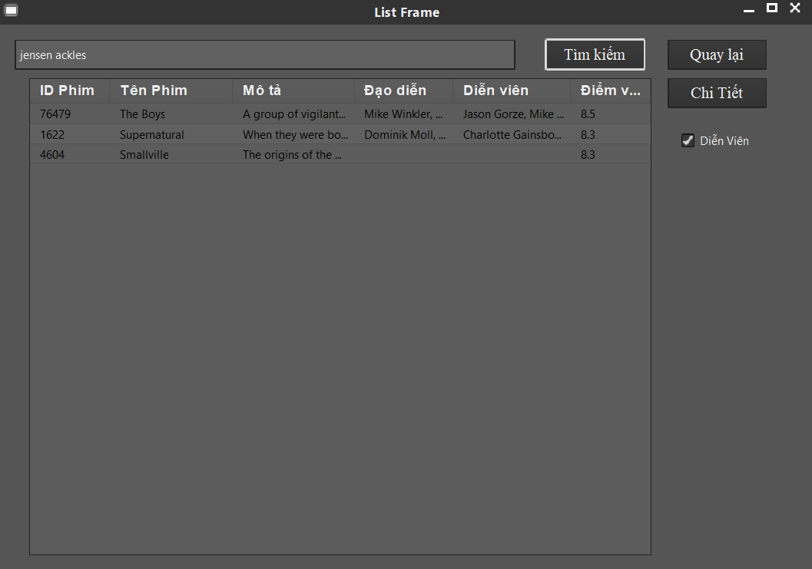

# Search Movies App

Using hybrid encryption (RSA for key and AES for data)

## Description

Base on client and server model

## Getting Started

### Dependencies

* Java language 
* Using some libraries like ImageJ, JTattoo, TensorFlow, org.json,...

### Installing

* Run server at first then run client

### Demo

* Home

* Search Movie

* Search Movie By Cast

* Movie Details

* Image Processing

* Object Recognition

* Find Image

## Acknowledgments

Maybe you can need it
* [imagej](https://github.com/imagej)
* [tensorflow](https://github.com/tensorflow)
* [org.json](https://mvnrepository.com/artifact/org.json/json)
